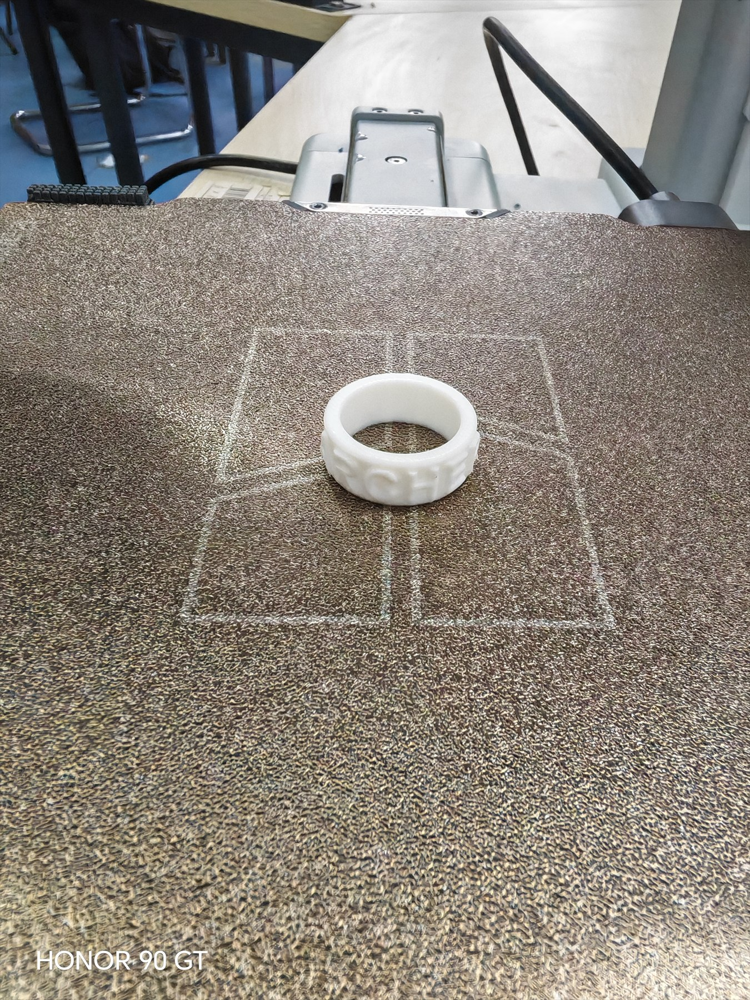
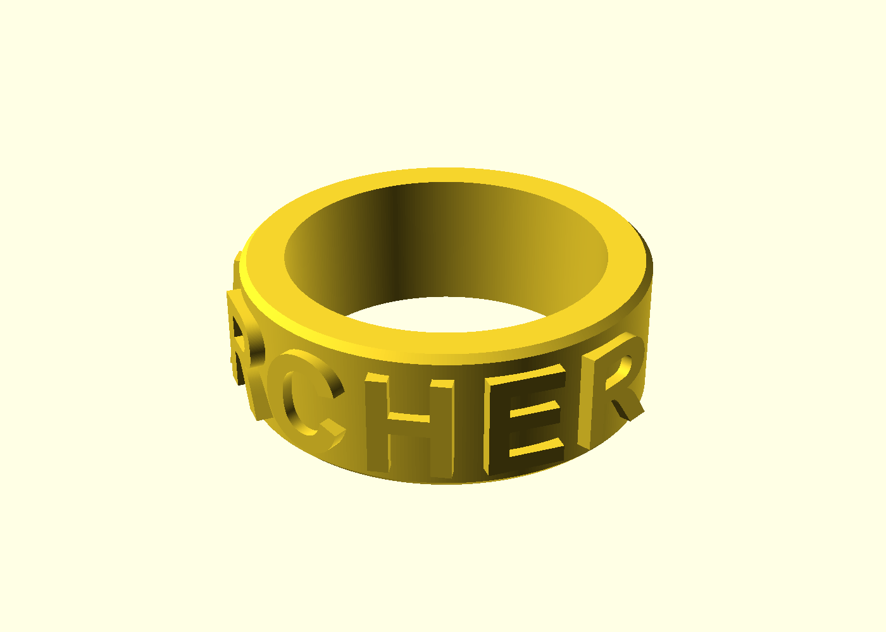

# 从代码到实物 · 课程仓库

> **软件工程 · 张涛**
> 学期项目：**自定义宏键盘 / 桌面控制台（macropad）**
> 已完成练习：**ARCHER 名字戒指**（3D 打印）

[](https://github.com/Archer-redA)

---

## 一、我是谁

- **专业**：软件工程
- **姓名**：张涛
- **GitHub**：[@Archer-redA](https://github.com/Archer-redA)

## 二、为什么选这门课

写了几年代码，但产出基本都停在屏幕里 —— 一个网页、一个脚本、一个跑在终端里的程序。它们能运行、能演示，但摸不到、拿不走。

我想试试另一条路：**让代码去驱动一个真实存在的东西**。按下按键，它要有反应；改一行配置，行为要真的跟着变。

这门课的名字恰好就是我想解决的问题 —— 「从代码到实物」。软件这一侧我相对熟悉，而电路、焊接、外壳、调试这些对我来说是全新的，正好是我想补的那一块。选它，是想给自己加一个约束：**必须动手，必须把东西真的做出来**，而不是又停在 `npm run dev`。

## 三、这学期想造什么

**一个自定义宏键盘 / 桌面控制台（macropad）。**

选它的理由很实际：

1. **规模可控。** 一个主控 + 几个按键 + 一个旋钮，属于「一学期内真能做完」的量级，而不是一个做不完的大项目。
2. **软硬都能练到。** 固件要写（按键扫描、去抖、HID 上报），上位机也要写（按键映射的配置工具），正好把软件工程的老本行和硬件接上。
3. **有真实用途。** 做出来我自己每天都会用，不容易半途而废。
4. **能持续长出功能。** 基础版做完还能加屏幕、加旋钮、加多层布局，仓库可以一直长到期末。

### 期末最低验收目标

- 至少 **6 个可编程按键** + **1 个旋钮**
- 按键功能可**通过配置文件重新映射**，不需要重新烧录固件
- 插到电脑上**免驱识别**为标准键盘 / 多媒体控制器

完整的验收标准、非目标与里程碑见 [`docs/需求与验收标准.md`](docs/需求与验收标准.md)。

## 四、仓库结构

```
.
├── README.md                  # 本文件
├── .gitignore
├── docs/
│   ├── 需求与验收标准.md        # 这个项目要做什么、怎么才算做完
│   ├── 工具链搭建.md            # 开发环境清单与逐项验证记录
│   └── 踩坑记录.md              # 卡得最久的问题 + 怎么解决的
├── hardware/
│   └── ring/                  # ARCHER 名字戒指：建模源文件 + STL + 预览图
│       ├── ring.scad          # 参数化建模脚本（改这个）
│       ├── ring.stl           # 可直接切片的成品
│       └── README.md          # 尺寸、打印参数、校验记录、已知取舍
└── tools/
    └── stl-check.js           # STL 水密性/流形校验工具
```

随项目推进，会陆续增加：

| 目录 | 用途 | 预计出现时间 |
|---|---|---|
| `firmware/` | 主控固件（按键扫描、HID 上报） | 第 3–4 周 |
| `host/` | 上位机按键映射配置工具 | 第 5–6 周 |
| `hardware/case/` | 宏键盘外壳 3D 模型 | 第 7–8 周 |

## 五、开发环境（工具链）

本学期使用的工具链，均已实测通过：

| 用途 | 工具 | 版本 | 验证方式 |
|---|---|---|---|
| 版本控制 | Git | `2.20.1.windows.1` | `git --version` |
| 远程仓库 | GitHub（**SSH over 443**） | — | `ssh -T git@github.com` |
| 代码编辑器 | VS Code | `1.133.0` | `code --version` |
| 脚本 / 上位机工具 | Node.js / npm | `v24.14.1` / `11.11.0` | `node --version` |
| 三维建模 | OpenSCAD | `2026.09.16` | `openscad --info` |
| 3D 打印机 | Bambu Lab A1 mini | FDM / 0.4mm 喷头 | — |

> ⚠️ **本机 HTTPS 方式访问 GitHub/Gitee 不可用**，已改用 SSH。原因、复现步骤与解决方案见 [`docs/踩坑记录.md`](docs/踩坑记录.md)。

> ⚠️ **OpenSCAD 的 `textmetrics()` 是实验性函数，默认关闭。**
> 图形界面需在「编辑 → 首选项 → 功能(Features)」里勾选 `textmetrics`，
> 命令行渲染需加 `--enable=textmetrics`。详见 `hardware/ring/README.md`。

详细的环境清点、缺口与补齐计划见 [`docs/工具链搭建.md`](docs/工具链搭建.md)。

## 六、第一件实物：ARCHER 名字戒指

**已经真的打印出来了**（2026-09-23，Bambu Lab A1 mini）：



这是建模阶段的渲染图，可以和上面的实物对比设计意图与实际结果：



把名字刻在戒指外圈，文字绕环 176°。**不是手动捏出来的，是写代码生成的** ——
整个模型由一个参数化脚本描述，改一个数字就能改尺寸、改文字。

| 项目 | 数值 |
|---|---|
| 外径 / 内径 / 带宽 / 壁厚 | 23 / 18 / 8 / 2.5 mm |
| 字高 / 凸起高度 | 5.5 mm / 0.6 mm |
| 网格体积 | 1335.8 mm³ |
| 预计耗材 | 约 1.66 g（PLA） |
| 水密性校验 | 开边 0、非流形 0、退化 0 —— **通过** |
| 实际打印 | 2026-09-23 完成，**一次成功**，耗时约 10 分钟，**效果良好** |

完整尺寸、打印参数、建模取舍与实拍记录见 [`hardware/ring/README.md`](hardware/ring/README.md)。

**这一步学到的三件事：**

1. **摆放方向决定成败。** 平放（轴向竖直）时文字全是垂直棱柱，零悬垂、不用支撑；
   立着放则下半圈整体是大角度悬垂，必然塌边。同一个模型，换个方向就是能用和不能用。
2. **打印机能打多细，是设计约束不是事后调参。** 0.4mm 喷头意味着笔画宽度不能低于
   0.8mm 左右，所以字必须用粗体 —— 这是设计阶段就要定下来的事。
3. **先校验再切片。** 自己写了个工具检查网格是否水密、是否流形，
   在源头把问题验掉，比在切片软件里看到莫名其妙的警告再回头查省事得多。
   这次模型一次打印成功、没出任何网格报错，验证了这一步是有效的。
4. **推荐参数和实际参数是两回事。** 我给的推荐层高是 0.12mm，但实际打印只花了约
   10 分钟，明显快于该预设的预期 —— 说明实际用的大概率是更快的档位。
   所以文档里「推荐值」和「实际值」必须分开记，否则下次照着推荐值打，
   永远不知道真实差异出在哪。

## 七、进度计划

| 周次 | 目标 | 状态 |
|---|---|---|
| 第 1 周 | 工具链搭建、仓库建立、需求与验收标准定稿 | ✅ 已完成 |
| 第 1 周 | 3D 建模环境就绪，完成 ARCHER 名字戒指并校验网格 | ✅ 已完成 |
| 第 1 周 | 戒指实际打印完成（A1 mini，一次成功） | ✅ 已完成 |
| 第 2–3 周 | 硬件选型、下单、主控点灯与按键扫描跑通 | ⬜ 未开始 |
| 第 4–5 周 | 固件：按键去抖 + HID 上报，插上即用 | ⬜ 未开始 |
| 第 6–7 周 | 上位机：按键映射配置工具 + 配置文件热加载 | ⬜ 未开始 |
| 第 8–10 周 | 外壳设计与 3D 打印，整机装配 | ⬜ 未开始 |
| 第 11–13 周 | 加分项：旋钮 / 小屏幕 / 多层布局 | ⬜ 未开始 |
| 第 14 周 | 整机联调、文档收尾、期末演示准备 | ⬜ 未开始 |

---

*本仓库为《从代码到实物》课程学期项目仓库，将持续更新至期末。*
