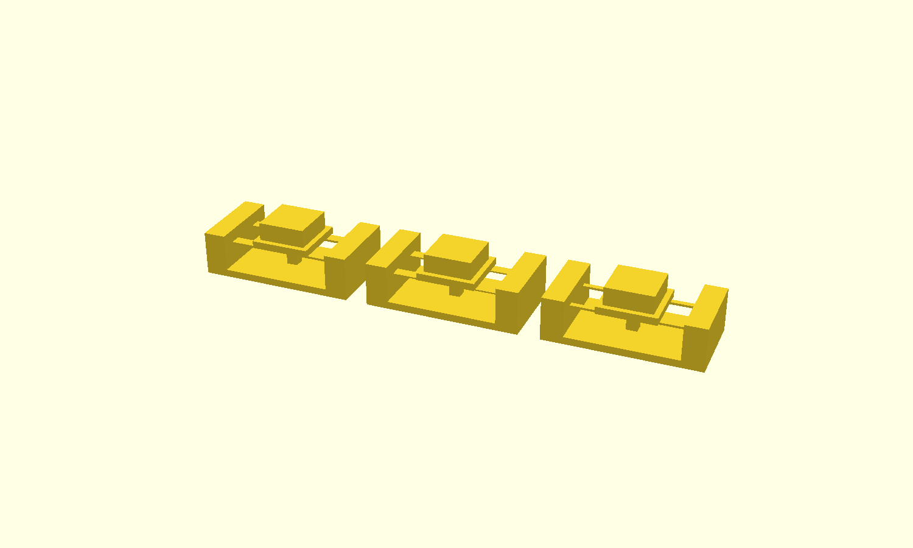
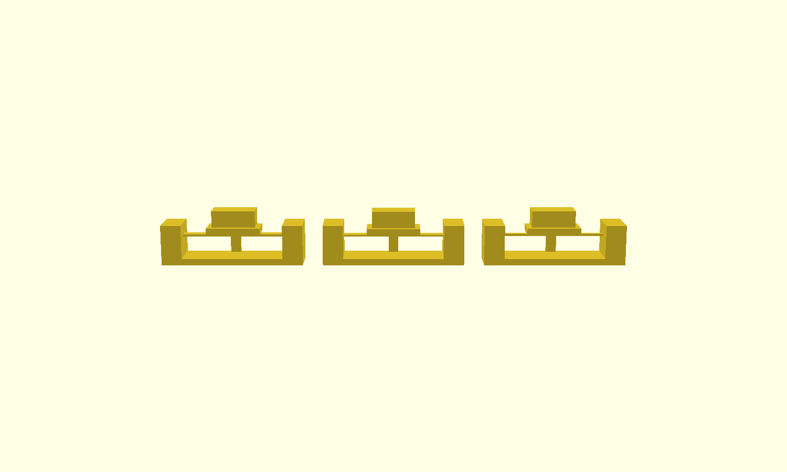
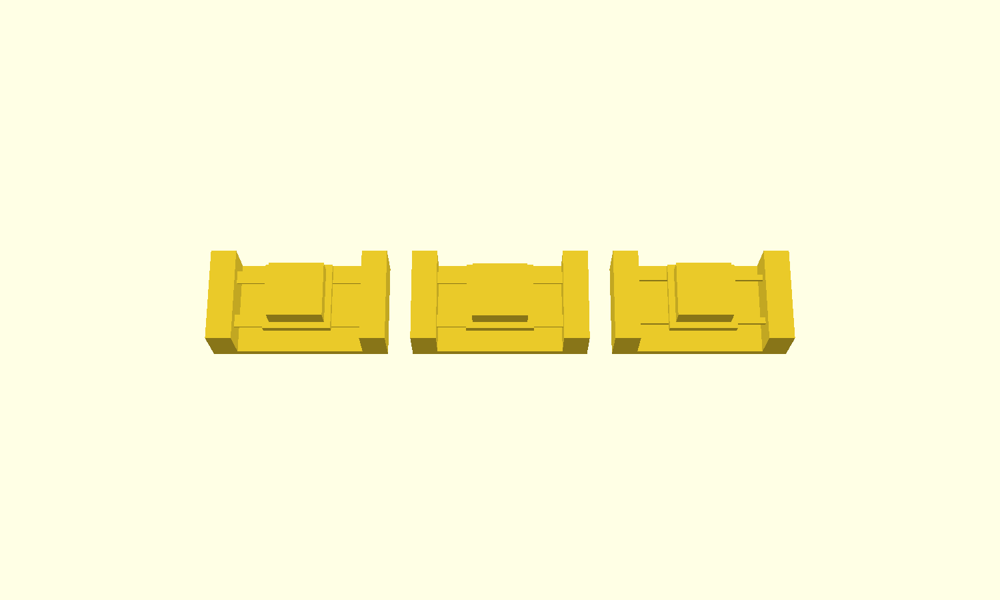

# 单键柔性机构测试片

> **目的：在做整机之前，先验证「桥式柔性梁」这个机构能不能成立。**
> 一片上放三个变体，一次打印验证三种刚度。







## 要解决的核心矛盾

一体打印的可动件有一个本质矛盾：

> **柔性件要能动，周围就得是空的；但空的地方打印时没有支撑，材料会塌。**

加支撑就违背了「一体打印、免组装」的前提。

**解法：把柔性梁做成「桥」** —— 两端都搭在实体墙上，中间悬空。

| | 打印时 | 受力时 |
|---|---|---|
| 桥式梁 | 一段桥，两端有支撑，桥接没问题 ✅ | 一根两端固定的梁，中间能下沉、能回弹 ✅ |

代价：两端固定的梁比悬臂梁**刚 8 倍**（端部弯矩大），同样行程下应变也高 8 倍。

## 力学计算

两端固定梁 + 中央集中载荷：

```
弯曲刚度     I = b·t³ / 12
单根梁刚度   k = 192·E·I / L³
最大应变     ε = 12·t·δ / L²      （应变在两端的固定处最大）
```

PLA 取 E ≈ 3500 MPa，L = 30mm，设计行程 δ = 1.5mm：

| 变体 | 梁厚 t | 梁宽 b | 厚度层数 | 刚度 k | 压到底需 | ε @1.5mm | ε 达 1.5% 时行程 |
|---|---|---|---|---|---|---|---|
| **A** | 0.6 mm | 3.0 mm | 3 | 2.69 N/mm | 4.03 N | 1.20% | 1.88 mm |
| **B** | 0.4 mm | 3.0 mm | 2 | 0.80 N/mm | **1.19 N** | 0.80% | 2.81 mm |
| **C** | 0.6 mm | 1.5 mm | 3 | 1.34 N/mm | 2.02 N | 1.20% | 1.88 mm |

**参照**：Cherry MX 红轴 45 gf ≈ 0.45 N，黑轴 60 gf ≈ 0.6 N。
所以三个变体都偏硬，**B 最接近真实手感**，但它只有 2 层厚，是三个里最脆的 ——
这正是要实测的东西：**理论上最合适的设计，打印出来到底扛不扛得住。**

> **1.5% 应变的来历**：PLA 的断裂延伸率约 3–6%，但反复弯曲要考虑疲劳，
> 安全区取 1.5% 以下。**超过这个值不会立刻断，而是按几次之后出现永久变形或裂纹。**

## 止挡设计

首次打印**不要**去掉止挡柱。理由：

- 柔性梁的应变与实际行程成正比，**人手上按多重是不可控的**
- 没有止挡时，用力一按就可能把梁压到 3% 应变以上，直接产生永久变形
- 止挡柱让行程硬性停在设计值，**梁的应变不会超过计算值**

止挡柱从底板上长出来，柱顶与平台底面之间正好留出 `TRAVEL`。

> ⚠️ 第一版我漏了底板，导致止挡柱**完全悬空** —— 打出来会是一根 3×3×6.5mm 的
> 散件掉在壳子里，根本起不到止挡作用。这个问题是**用连通分量检测抓出来的**，
> 见下节。已修复。

## 校验

```bash
node ../../tools/stl-check.js key-test.stl 0.000001 3
```

```
triangles    : 432
size (mm)    : X=138  Y=22  Z=15.6
open edges   : 0
non-manifold : 0
degenerate   : 0
components   : 3 (expected 3)  sizes: 144 + 144 + 144 tris
结论          : 通过 —— 水密流形，可以打印
```

**第三个参数 `3` 是预期的连通分量数。** 这个参数是为一体打印件专门加的：

- 一体打印的零件**必须是连通的**，分开的壳体会变成打出来掉在里面的散件
- 而**切片软件不会为此报警** —— 它照样能把两个分离的实体切成两个独立的打印件，只是你不知道
- 所以必须自己验：每个变体是一个分量，三个变体就是三个分量
- **三个分量大小完全相等（144+144+144）**，说明每个变体内部都是连通的，止挡柱没掉

## 打印参数

| 参数 | 取值 | 说明 |
|---|---|---|
| 层高 | **0.2 mm** | **梁厚必须是层高的整数倍**，否则实际厚度不由你控制 |
| 支撑 | **关闭** | 桥式梁本来就是为了免支撑设计的 |
| 摆放 | 平放，与脚本朝向一致 | 不要旋转模型 |
| 墙数 | 3 | |
| 填充 | 15% | |

**层高这条特别重要**：变体 B 的梁设计厚度是 0.4mm，如果层高是 0.3mm，切片软件
只能给你 0.3 或 0.6mm —— 那刚度和应变跟算出来的完全对不上，测试就白做了。

## 怎么测

打印完成后，逐个按下三个键（从左到右是 A / B / C）：

| 检查项 | 合格标准 |
|---|---|
| 能否按下 | 三个都能明显下沉 |
| 回弹 | 松手后回到原位，无残留变形 |
| 相邻独立 | 按一个键时旁边的键不动（这一片是独立单元，主要测整机时用） |
| **按压 500 次** | 用拇指连续按，不出现白化、裂纹、断裂 |
| 手感排序 | 记录 A/B/C 哪个最舒服，与计算值对比 |

**建议把结果记回来**（改这一节就行）：

| 变体 | 实测手感 | 500 次后状态 |
|---|---|---|
| A | 待填 | 待填 |
| B | 待填 | 待填 |
| C | 待填 | 待填 |

## 参数怎么改

都在 `key-test.scad` 顶部：

```openscad
SPAN    = 30;     // 自由跨距 —— 应变 ∝ 1/L²，这是最有效的调节手段
TRAVEL  = 1.5;    // 设计行程 —— 同时决定止挡柱高度
VARIANTS = [      // [梁厚, 梁宽]
    [0.6, 3.0],
    [0.4, 3.0],
    [0.6, 1.5],
];
```

**跨距不能随便加大**：`SPAN` 同时是桥接长度，超过约 35mm 打印时会塌。
这是「机构设计」和「可打印性」直接冲突的地方 —— **也是这个项目最难的一处权衡**。

出图时控制台会打印每个变体的刚度、所需压力、应变，改完直接看数字即可。
`CUT = 1` 可以出一张剖视图，用来检查梁、平台、止挡柱的相对位置。
